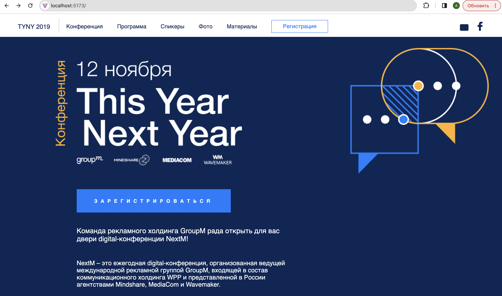
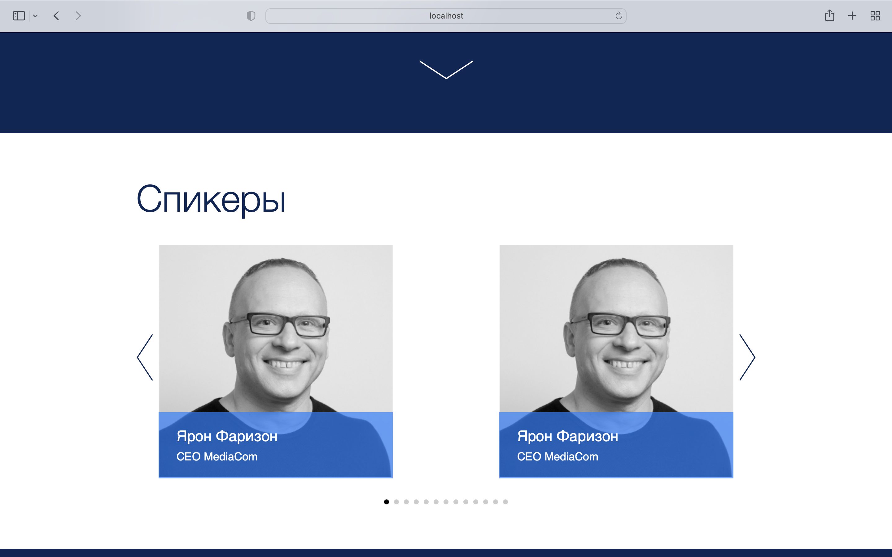
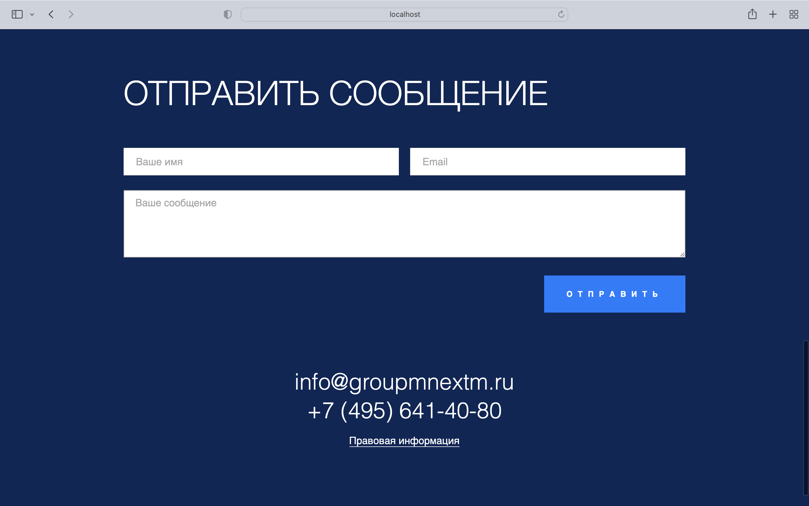

# Проект [bonovizio](https://github.com/AlexFromNorth/bonovizio) | Frontend / SCSS

### 📜 Описание:
Верстка одностраничного макета с Figma по тех. заданию.
Созданно с применением `yarn create vite`, имеет адаптив и кроссбраузерность. Применена методология БЭМ.

### ⚙️ Функционал:
* Single Page Application 

* Отправку форму в консоль
  
* Слайдер

* Бургер-меню


### 🥞 Стек(из требований ТЗ):

`HTML5` `SCSS` `JavaScript ES6+` `БЭМ` `Vite` `Swiper` `Normalize` 

### 💽 Установка и запуск:

1. Склонировать репозиторий в текущую папку:

```git clone https://github.com/AlexFromNorth/bonovizio ./```

2. Установить зависимости:

```yarn install```

3. Запустить проект в режиме разработки:

```yarn run dev ```

4. Откройте: 

```http://localhost:5173/```

<br />
<br />

<br />
<br />

<br />
<br />

<br />
<br />


